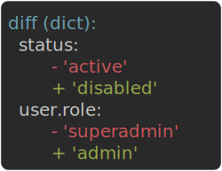

# Getting Started

## Install

```bash
pip install assertpy2
```

Optional extras: `assertpy2[json]` (JSONPath / JSON Schema), `assertpy2[allure]`, `assertpy2[behave]`.

!!! tip "Coming from the original assertpy?"
    assertpy2 is a drop-in replacement on Python 3.10+. See [Migrating from assertpy](migration.md) for
    the one-line switch and what you gain.

## Your first assertion

Wrap a value in `assert_that()` and chain assertions that read like a sentence:

```python
from assertpy2 import assert_that

assert_that("foobar").is_length(6).starts_with("foo").ends_with("bar")
assert_that([1, 2, 3]).contains(1).does_not_contain(9).is_subset_of([1, 2, 3, 4])
```

Because every assertion is statically typed, your editor only suggests methods valid for the value's
type, and a type checker flags misuse before the test runs. See [Type Safety](type-safety.md) for how the
overloads work.

## When an assertion fails

A failing assertion raises an `AssertionError` with a precise message:

```python
assert_that(5).is_greater_than(10)
# AssertionError: Expected <5> to be greater than <10>, but was not.
```

For dicts, dataclasses, and other structures, the pytest plugin renders a path-level diff that points
straight at the differing field instead of dumping the whole value:

```python
assert_that(actual).is_equal_to(expected)
```



The same path-level diff backs `matches_structure()`, `satisfies()`, and `each()`. See
[Errors & Reporting](errors.md) for the full diff format and configuration.

## Collect multiple failures

Use soft assertions to report every failure at once instead of stopping at the first:

```python
from assertpy2 import assert_that, soft_assertions

with soft_assertions():
    assert_that("foo").is_length(3)
    assert_that("foo").starts_with("x")   # collected
    assert_that("foo").ends_with("z")     # collected
```

## Next steps

- [Matchers](matchers.md) for composable, reusable conditions.
- [Fluent API](fluent.md) for chaining, negation, and the collection pipeline.
- Browse the assertion reference in the navigation for every type-specific assertion.
