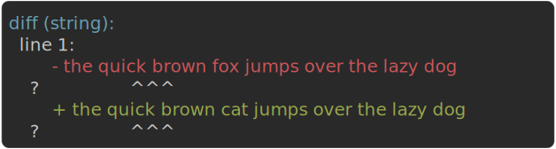
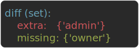

# Errors & Reporting

## Structured errors

A failing assertion raises `AssertionFailure`, a subclass of `AssertionError` that carries structured
data. Existing `except AssertionError` handlers keep working unchanged.

```python
from assertpy2 import assert_that

try:
    assert_that(1).is_equal_to(2)
except AssertionError as e:
    print(e.actual)     # 1
    print(e.expected)   # 2
```

For comparisons, a `DiffResult` with path-level entries is attached:

```python
try:
    assert_that({"a": 1, "b": 2}).is_equal_to({"a": 1, "b": 99})
except AssertionError as e:
    print(repr(e.diff))
    # DiffResult(kind='dict', entries=[DiffEntry(path='b', actual=2, expected=99)])
```

The diff is also rendered into the failure **message**, so it travels with `str(e)` wherever the
exception surfaces - `unittest`, a plain script, an `AssertionError` in a CI log:

```python
try:
    assert_that({"a": 1, "b": 2}).is_equal_to({"a": 1, "b": 99})
except AssertionError as e:
    print(e)
    # Expected <{.., 'b': 2}> to be equal to <{.., 'b': 99}>, but was not.
    # diff (dict):
    #   b:
    #     - 2
    #     + 99
```

The `..` in that message stands for the parts that matched. Only what differs is spelled out, so a
one-field change in a wide object reads as `{.., 'b': 2}` rather than as both objects in full.

Sequences collapse the same way once they grow past a line or so, which keeps a single changed element
out of a forty-item dump:

```python
try:
    assert_that(list(range(40))).is_equal_to([*range(27), 999, *range(28, 40)])
except AssertionError as e:
    print(e)
    # Expected <[.., 27]> to be equal to <[.., 999]>, but was not.
    # diff (sequence):
    #   [27]:
    #     - 27
    #     + 999
```

A multi-line value is collapsed by line, which matters most: every line of it costs a row of terminal,
and the message carries the value twice.

```python
try:
    assert_that("line 1\nline 2\nline 3\nline 4").is_equal_to("line 1\nline 2\nline THREE\nline 4")
except AssertionError as e:
    print(e)
    # Expected <.., line 3: line 3> to be equal to <.., line 3: line THREE>, but was not.
```

Short values are printed whole, since collapsing them would hide context to save a few characters.

When almost nothing matches there is little to collapse, so the message names the first few differences
and counts the rest as `... and N more`.

Either way every difference stays in the diff, so the shorter message loses nothing.

Matcher-based assertions (`matches_structure()`, `satisfies()`, `each()`) attach a `DiffResult` with
`kind='match'`, where each entry's `expected` holds the failed predicate's description.

Under pytest the plugin renders this same diff as a dedicated colored report section instead, keeping
the message itself to a single line so the diff is never shown twice. It is auto-registered through the
`pytest11` entry point and needs no configuration.

See [Rich pytest diffs](#rich-pytest-diffs) for supported types and configuration.

## Rich pytest diffs

When `is_equal_to()` or `contains()`/`contains_exactly()` fail, the `DiffResult` on the exception is
rendered by the plugin as colored diff sections.

| Type | Diff kind | How it works |
|---|---|---|
| `list`, `tuple` | `sequence` | Element-by-element, recursive into nested dicts, lists, dataclasses, namedtuples, attrs classes, and models |
| `set`, `frozenset` | `set` | Extra and missing items |
| `str` | `string` | Line-by-line, with difflib carets marking the exact intra-line change |
| `dict` | `dict` | Key-by-key, recursive into nested dicts, lists, dataclasses, namedtuples, attrs classes, and models |
| `dataclass` | `dataclass` | Field-by-field, handles differing types with overlapping fields |
| `namedtuple` | `namedtuple` | Field-by-field comparison |
| Pydantic model | `model` | Field-by-field via `model_dump()`, recursive into nested models |
| attrs class | `attrs` | Field-by-field, recursive into nested fields |
| other | `scalar` | Single actual-vs-expected entry |
| `contains` family | `contains` | Missing and extra items, plus the repeat counts for a duplicate failure |
| matcher mismatch | `match` | `satisfies()`, `each()`, `all_satisfy()`, `any_satisfy()`, `satisfies_exactly()`, `zip_satisfies()`, `matches_structure()`, `all_fields_satisfy()`: path + failed predicate |

```text
--- AssertionFailure ---
  actual:   [{'id': 1, 'name': 'Alice'}, {'id': 2, 'name': 'Bob'}]
  expected: [{'id': 1, 'name': 'Alice'}, {'id': 2, 'name': 'Robert'}]
```

The diff for that failure, and the other diff shapes, render like this.

The comparison is recursive, so for a very large or deeply nested value it walks the whole object graph.

When the payload is huge and you care about a few fields, extract those and assert on them instead. It
is faster and the failure stays focused. See
[When full structural comparison is too much](../recipes.md#when-full-structural-comparison-is-too-much).

### What each diff kind looks like

**Value diffs** (`sequence`, `dict`, `dataclass`, `namedtuple`, `attrs`, Pydantic `model`, `string`,
`scalar`) show the path with the removal in red and the addition in green. This is the diff for the
example above:

![Colored sequence diff: [1].name with the removal in red and the addition in green](../assets/diff-sequence.svg)

String values go finer than line-by-line. Each changed line is diffed *within the line*, with difflib
carets (`? ^^^`) pointing at the exact span, the same guides pytest's own assertion rewriting uses.

`bytes` and `bytearray` take that path too, pointed at through their `b'...'` form:



The carets appear only when the two lines still resemble each other, at difflib's own 0.75 similarity
cutoff.

Past that the two lines are printed plainly. A guide underlining most of the line says nothing the pair
of values does not already say.

**Set and contains** show extra items in red and missing items in green:



**Match** (the matcher-driven assertions listed in the table above) shows each field's path and the
predicate that failed, with the actual value in red.

Every mismatch is listed, not just the first. There is no green, since a predicate has no "addition".


Nested structures are diffed recursively and report the exact path to the differing value (for example
`[1].name`). Circular references are detected and shown as `<circular ref>` rather than recursing forever.

Two values can render to the same text and still not be equal, most often because they differ only in
type.

The message then tags each with its type, so `assert_that("1").is_equal_to(1)` reads
`Expected <1:str> to be equal to <1:int>, but was not.` rather than a baffling `<1>` / `<1>`.

!!! note
    Cycle detection covers every walker this library owns:

    - the diff rendering, and the selective-comparison path (`ignore` / `include`), which treat a
      revisited pair as equal rather than recursing
    - a contract snapshot, which records a revisited node as `<circular ref>`
    - a value snapshot, which fails with a message naming the cycle, since json cannot represent one

    The bare equality check is not ours: it follows Python's own `==`, so two structurally equal
    *cyclic* graphs raise `RecursionError` exactly as a plain `assert a == b` would.

### Polling failures carry a trace

An [`eventually()`](testing.md#async-assertions) timeout attaches its convergence telemetry as
`failure.trace` - a [`PollTrace`][assertpy2.errors.PollTrace] with per-poll
[`PollSample`][assertpy2.errors.PollSample] entries and a one-line trend summary. See
[Polling trace](testing.md#polling-trace).

### Catching failures with their types intact

`pytest.raises(AssertionError)` types the caught exception as plain `AssertionError`, so a type
checker flags `.actual` / `.expected` / `.diff` access. Catch `AssertionFailure` instead - it is the
subclass actually raised whenever structured data is attached:

```python
import pytest
from assertpy2 import AssertionFailure, assert_that

def test_diff_is_machine_readable():
    with pytest.raises(AssertionFailure) as exc_info:
        assert_that({"role": "guest"}).is_equal_to({"role": "admin"})

    failure = exc_info.value  # typed as AssertionFailure
    assert_that(failure.diff.kind).is_equal_to("dict")
    assert_that(failure.diff.entries[0].path).is_equal_to("role")
```

The rich diff comes from the fluent form. The `==` drop-in for matchers (for example
`assert response == {"id": match.is_positive()}`) hands rendering to pytest instead, which prints its
own dict comparison without the path.

### Configuration

```toml
[tool.pytest.ini_options]
assertpy2_diff = "off"              # disable structured diff sections entirely
assertpy2_diff_max_entries = "100"  # max entries to show (default 50, 0 = unlimited)
assertpy2_poll_report = "off"       # silence the near-timeout poll report (default 0.7)
```

With `--color=yes`, diffs are colored: red removals, green additions, cyan headers. Entries beyond
the limit are hidden behind a `... and N more entries` summary.

The plugin also adds `assertpy2_allure` (see [Allure](../extending/integrations.md#allure)) and these
command-line flags, each documented where it is used:

| Flag | What it does |
|---|---|
| [`--assertpy2-vacuous`](assertions.md#assertions-that-checked-nothing) | Warn when a universal assertion passes over an empty value |
| [`--assertpy2-snapshot-update`](testing.md#snapshot-testing) | Overwrite failing snapshots with the current values |
| [`--assertpy2-snapshot-ci`](testing.md#snapshot-testing) | Fail instead of creating a missing snapshot (auto-enabled on CI) |
| `--assertpy2-snapshot-no-ci` | Disable CI mode and its autodetection |

## Failure and expected exceptions

### fail()

Force a test failure explicitly:

```python
from assertpy2 import fail

fail("forced failure")
```

### Expected exceptions

For a called function, assert it raises and chain assertions on the message:

```python
assert_that(some_func).raises(RuntimeError).when_called_with("foo")
assert_that(some_func).raises(RuntimeError).when_called_with("foo").is_equal_to(
    "some err"
)
```

Or assert it does **not** raise a given exception:

```python
assert_that(safe_func).does_not_raise(ValueError).when_called_with("foo")
```

!!! tip
    For the common "did it raise?" case without inspecting the message, prefer pytest's
    `pytest.raises` context manager.

Beyond the message, the caught exception can be inspected in three more ways.

**The exception object** - `raised()` pivots to the caught exception itself, so you can assert on its
type, `args`, or custom attributes, not only its message string:

```python
err = assert_that(load).raises(ConfigError).when_called_with("bad.toml").raised().value
assert_that(err.code).is_equal_to(42)
```

**The cause chain.** `caused_by()` asserts the exception was chained from a given cause, either an
explicit `raise ... from` or one raised during handling.

`has_root_cause()` walks to the root of the chain. Both pivot to that cause's message, so the chain
continues:

```python
# def save(row): ... raise ServiceError("save failed") from TimeoutError("db timeout")
assert_that(save).raises(ServiceError).when_called_with(row).caused_by(TimeoutError)
assert_that(save).raises(ServiceError).when_called_with(row).has_root_cause(
    TimeoutError
).is_equal_to("db timeout")
```

**Exception groups** (`ExceptionGroup`, Python 3.11+, e.g. from an `asyncio.TaskGroup`) - `contains_error()`
asserts the caught group contains, recursively, an exception of each given type:

```python
assert_that(run_tasks).raises(ExceptionGroup).when_called_with().contains_error(
    ValueError, KeyError
)
```

### Expected warnings

For a called function, assert it emits a warning and chain assertions on the warning message:

```python
assert_that(deprecated_func).warns(DeprecationWarning).when_called_with("foo")
assert_that(deprecated_func).warns(DeprecationWarning).when_called_with("foo").matches(
    "since 2.6"
)
```

The category defaults to `Warning` (matches any warning) and matches subclasses. Or assert it does
**not** emit a given category:

```python
assert_that(safe_func).does_not_warn(DeprecationWarning).when_called_with("foo")
```

To also assert on the value the call returned (alongside the warning, or after `does_not_warn` /
`does_not_raise`), pivot with `returned()`:

```python
(
    assert_that(make_client).warns(DeprecationWarning).when_called_with()
    .returned().is_instance_of(Client)
)
(
    assert_that(adder).does_not_raise(TypeError).when_called_with(1, 2)
    .returned().is_equal_to(3)
)
```

`returned()` exposes the type-agnostic core assertions (`is_equal_to`, `is_instance_of`, `satisfies`,
...). It raises `TypeError` if the call raised (there is no return value to inspect).

!!! warning "Not thread-safe"
    `warns()` / `does_not_warn()` rely on `warnings.catch_warnings()`, which mutates process-global
    state.

    They are safe within a single thread, including multiple `asyncio` tasks on one event loop.
    Concurrent use across OS threads can interfere, the same limitation `pytest.warns` and
    `unittest.assertWarns` carry.

### Custom error messages

`described_as()` prepends a custom label to the failure message:

```python
assert_that(1 + 2).described_as("adding stuff").is_equal_to(2)
# [adding stuff] Expected <3> to be equal to <2>, but was not.
```

### Warnings instead of failures

For defensive assertions outside tests, replace `assert_that` with `assert_warn`: failures log a
warning instead of raising:

```python
assert_warn("foo").is_length(4)   # logs a warning, does not raise
```

!!! note "`assert_warn()` vs `warns()`"
    These are unrelated despite the similar names.

    `assert_warn(...)` is a *soft* entry point. The assertion still checks your value, but logs a
    warning instead of raising on failure.

    `assert_that(func).warns(...)` goes the opposite way. It asserts that calling `func` *emits* a
    Python warning.

??? note "Warning output and custom logger"
    ```
    2019-10-27 20:00:35 WARNING [app.py:42]: Expected <foo> to be of length <4>, but was <3>.
    ```

    Pass your own logger for custom formatting:

    ```python
    assert_warn("foo", logger=my_logger).is_length(4)
    ```

    The `assertpy2` logger carries its own handler and also propagates, so if your suite calls
    `logging.basicConfig()` each warning is printed twice. Turning propagation off silences the
    duplicate:

    ```python
    logging.getLogger("assertpy2").propagate = False
    ```

    That trade is yours to make: propagation is also how pytest's `caplog` fixture receives these
    records, so turning it off stops you asserting on them.
