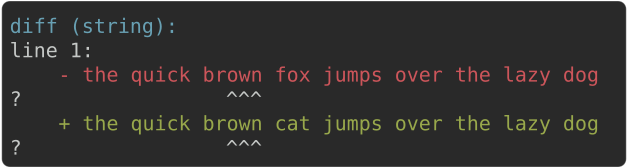
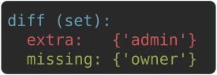
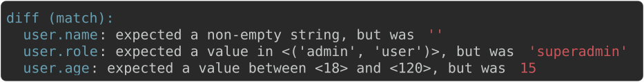

# Errors & Reporting

## Structured errors

A failing assertion raises `AssertionFailure`, a subclass of `AssertionError` that carries structured
data. Existing `except AssertionError` handlers keep working unchanged.

```python
from assertpy2 import AssertionFailure, assert_that

try:
    assert_that(1).is_equal_to(2)
except AssertionFailure as e:
    print(e.actual)     # 1
    print(e.expected)   # 2
```

Catching the subclass is what gives a type checker the structured fields: `except AssertionError`
still runs, but types `e` as the base class, which declares none of them.

For comparisons, a `DiffResult` with path-level entries is attached:

```python
try:
    assert_that({"a": 1, "b": 2}).is_equal_to({"a": 1, "b": 99})
except AssertionFailure as e:
    assert e.diff is not None   # every comparison failure carries one, other failures do not
    entry = e.diff.entries[0]
    print(entry.path, entry.actual, entry.expected)   # b 2 99
```

### Paths a program can follow

`entry.path` is written for a person and cannot be read back. A mapping key goes through `str()`, so
`{3: "a"}` and `{"3": "a"}` produce the same text, and a key holding a dot or a bracket has no grammar
to parse it with.

`entry.steps` is the same location in the form a program can act on: a tuple of
[`Step`][assertpy2.errors.Step], each holding the key, index, field name, set member or line number
itself, untouched.

```python
from typing import Any

data = {"users": [{"roles": {7: "admin"}}]}

try:
    assert_that(data).is_equal_to({"users": [{"roles": {7: "guest"}}]})
except AssertionFailure as e:
    assert e.diff is not None
    entry = e.diff.entries[0]
    print(entry.path)                                  # users[0].roles.7
    print([(s.kind, s.value) for s in entry.steps])
    # [('key', 'users'), ('index', 0), ('key', 'roles'), ('key', 7)]

    cursor: Any = e.actual   # `actual` is `object`: the library does not know your payload's shape
    for step in entry.steps:
        cursor = cursor[step.value]
    print(cursor)                                      # admin
```

An empty `steps` means the difference is the whole value, which is the entry whose `path` renders as
`.`. It is also empty where the path is a label rather than a location: a containment failure reports
`missing` and `extra`, and an item that is not in a collection has no position in it.

A sequence whose two sides have shifted apart is the one case where an index alone is ambiguous, since
the index spaces no longer agree. There the step names its `side` (`actual` or `expected`), matching
the `actual[2]` / `expected[1]` the path renders.

The diff is also rendered into the failure **message**, so it travels with `str(e)` wherever the
exception surfaces - `unittest`, a plain script, an `AssertionError` in a CI log:

```python
try:
    assert_that({"a": 1, "b": 2}).is_equal_to({"a": 1, "b": 99})
except AssertionError as e:
    print(e)
    # Expected <{.., 'b': 2}> to be equal to <{.., 'b': 99}>, but was not.
    # diff (dict):
    #   b:
    #     - 2
    #     + 99
```

The `..` in that message stands for the parts that matched. Only what differs is spelled out, so a
one-field change in a wide object reads as `{.., 'b': 2}` rather than as both objects in full.

Sequences collapse the same way once they grow past a line or so, which keeps a single changed element
out of a forty-item dump:

```python
try:
    assert_that(list(range(40))).is_equal_to([*range(27), 999, *range(28, 40)])
except AssertionError as e:
    print(e)
    # Expected <[.., 27]> to be equal to <[.., 999]>, but was not.
    # diff (sequence):
    #   [27]:
    #     - 27
    #     + 999
```

Sequences are aligned before they are compared, so an element inserted or removed is reported as
itself rather than as a mismatch at every index after it:

```python
try:
    assert_that([0, *range(1, 40)]).is_equal_to(list(range(1, 40)))
except AssertionError as e:
    print(e)
    # Expected <[.., 0]> to be equal to <[..]>, but was not.
    # diff (sequence):
    #   actual[0]: - 0
```

Comparing position by position would have called all forty elements different. A one-sided entry names
the sequence its index belongs to, because once the two sides have shifted their index spaces no longer
agree.

The alignment is used only where a sequence changed length, and then only where it reads shorter than
the plain index comparison. A reversal, a coordinate pair and anything else of unchanged length keep
the positional reading, so a comparison that could not benefit does not pay for the attempt. Sequences
over a thousand elements are not aligned at all.

A multi-line value is collapsed by line, which matters most: every line of it costs a row of terminal,
and the message carries the value twice.

```python
try:
    assert_that("line 1\nline 2\nline 3\nline 4").is_equal_to("line 1\nline 2\nline THREE\nline 4")
except AssertionError as e:
    print(e)
    # Expected <.., line 3: line 3> to be equal to <.., line 3: line THREE>, but was not.
```

Short values are printed whole, since collapsing them would hide context to save a few characters.

When almost nothing matches there is little to collapse, so the message names the first few differences
and counts the rest as `... and N more`.

Either way every difference stays in the diff, so the shorter message loses nothing.

Matcher-based assertions (`matches_structure()`, `satisfies()`, `each()`) attach a `DiffResult` with
`kind='match'`, where each entry's `expected` holds the failed predicate's description.

Under pytest the plugin renders this same diff as a dedicated colored report section instead, keeping
the message itself to a single line so the diff is never shown twice. It is auto-registered through the
`pytest11` entry point and needs no configuration.

See [Rich pytest diffs](#rich-pytest-diffs) for supported types and configuration.

## Rich pytest diffs

When `is_equal_to()` or `contains()`/`contains_exactly()` fail, the `DiffResult` on the exception is
rendered by the plugin as colored diff sections.

| Type | Diff kind | How it works |
|---|---|---|
| `list`, `tuple` | `sequence` | Element-by-element, recursive into nested dicts, lists, dataclasses, namedtuples, attrs classes, and models |
| `set`, `frozenset` | `set` | Extra and missing items |
| `str` | `string` | Line-by-line, with difflib carets marking the exact intra-line change |
| `dict` | `dict` | Key-by-key, recursive into nested dicts, lists, dataclasses, namedtuples, attrs classes, and models |
| `dataclass` | `dataclass` | Field-by-field, handles differing types with overlapping fields |
| `namedtuple` | `namedtuple` | Field-by-field comparison |
| Pydantic model | `model` | Field-by-field via `model_dump()`, recursive into nested models |
| attrs class | `attrs` | Field-by-field, recursive into nested fields |
| other | `scalar` | Single actual-vs-expected entry |
| `contains` family | `contains` | Missing and extra items, plus the repeat counts for a duplicate failure |
| matcher mismatch | `match` | `satisfies()`, `each()`, `all_satisfy()`, `any_satisfy()`, `satisfies_exactly()`, `zip_satisfies()`, `matches_structure()`, `all_fields_satisfy()`: path + failed predicate |

```text
--- AssertionFailure ---
  actual:   [{'id': 1, 'name': 'Alice'}, {'id': 2, 'name': 'Bob'}]
  expected: [{'id': 1, 'name': 'Alice'}, {'id': 2, 'name': 'Robert'}]
```

That section carries the values the assertion named. Every failure holds the value under test on
`failure.actual`, but most messages open with it, so a `contains_key()` failure shows the diff without
repeating its subject above it.

The diff for that failure, and the other diff shapes, render like this.

The comparison is recursive, so for a very large or deeply nested value it walks the whole object graph.

When the payload is huge and you care about a few fields, extract those and assert on them instead. It
is faster and the failure stays focused. See
[When full structural comparison is too much](../recipes.md#when-full-structural-comparison-is-too-much).

### What each diff kind looks like

**Value diffs** (`sequence`, `dict`, `dataclass`, `namedtuple`, `attrs`, Pydantic `model`, `string`,
`scalar`) show the path with the removal in red and the addition in green. This is the diff for the
example above:

![Colored sequence diff: [1].name with the removal in red and the addition in green](../assets/diff-sequence.svg)

String values go finer than line-by-line. Each changed line is diffed *within the line*, with difflib
carets (`? ^^^`) pointing at the exact span, the same guides pytest's own assertion rewriting uses.

`bytes` and `bytearray` take that path too, pointed at through their `b'...'` form:



The carets appear only when the two lines still resemble each other, at difflib's own 0.75 similarity
cutoff.

Past that the two lines are printed plainly. A guide underlining most of the line says nothing the pair
of values does not already say.

**Set and contains** show extra items in red and missing items in green:



**Match** (the matcher-driven assertions listed in the table above) shows each field's path and the
predicate that failed, with the actual value in red.

Every mismatch is listed, not just the first. There is no green, since a predicate has no "addition".



Nested structures are diffed recursively and report the exact path to the differing value (for example
`[1].name`). Circular references are detected and shown as `<circular ref>` rather than recursing forever.

Two values can render to the same text and still not be equal, most often because they differ only in
type.

The message then tags each with its type, so `assert_that("1").is_equal_to(1)` reads
`Expected <1:str> to be equal to <1:int>, but was not.` rather than a baffling `<1>` / `<1>`.

!!! note
    Cycle detection covers every walker this library owns:

    - the diff rendering, and the selective-comparison path (`ignore` / `include`), which treat a
      revisited pair as equal rather than recursing
    - a contract snapshot, which records a revisited node as `<circular ref>`
    - a value snapshot, which fails with a message naming the cycle, since json cannot represent one

    The bare equality check is not ours: it follows Python's own `==`, so two structurally equal
    *cyclic* graphs raise `RecursionError` exactly as a plain `assert a == b` would.

### The comparison settings are named back to you

`ignore` and `include` appear inside the failure sentence. The rest of the comparison settings get a
line of their own, so a failure under `tolerance`, `comparators`, `ignore_null` or `strict_types`
says which of them were in force:

```python
from assertpy2 import assert_that

try:
    assert_that({"price": 1.0}).is_equal_to({"price": 9.0}, tolerance=0.001, strict_types=True)
except AssertionError as failure:
    print(str(failure).splitlines()[1])
    # compared with tolerance=0.001, strict_types=True
```

Nothing is added on an ordinary failure, where every setting sits at its default. The line goes
below the sentence rather than into it, so the original text stays a prefix and a `match=` written
against it keeps matching.

### Some failures say why, not only what

A diff says what differs. There are failures where that leaves the hard part undone: two strings that
render identically and differ in a trailing space, or a comparison that could never have passed
because a NaN was in it. Where the whole difference has one explanation, it gets a line:

```python
from assertpy2 import assert_that

try:
    assert_that({"user": {"name": "bob "}}).is_equal_to({"user": {"name": "bob"}})
except AssertionError as failure:
    print(str(failure).splitlines()[1])
    # every difference here is one of surrounding whitespace
```

The line appears only when it accounts for **every** entry in the diff. A half-explanation is worse
than none: you would act on it and land back at the same failure. So a value that is simply wrong
gets nothing, and neither does a failure where one field differs by whitespace and another by its
content.

The one a JSON payload produces more than any other is a field that came back as text. The diff shows
`- 7` against `+ '7'` on every row, and the line says it once:

```python
from assertpy2 import assert_that

payload = {"id": 7, "quantity": 3}

try:
    assert_that(payload).is_equal_to({"id": "7", "quantity": "3"})
except AssertionError as failure:
    print(str(failure).splitlines()[1])
    # every difference here is the same text against a value of another type
```

A single value compared on its own says it in the sentence instead, tagging each side with its type
(`Expected <7:int> to be equal to <7:str>`), so the line stays away rather than repeating it.

`NaN` is stated first whatever else differs, since no value on the other side could have made that
comparison pass:

```python
from assertpy2 import assert_that

try:
    assert_that(float("nan")).is_equal_to(float("nan"))
except AssertionError as failure:
    print(str(failure).splitlines()[1])
    # a NaN takes part in this comparison, and a NaN is equal to nothing, not even itself
```

The other failure that leaves a reader stuck is two values that print the same and are not equal. A
class that defines no `__eq__` compares by identity, so an expected value your test built is never
equal to the one the code returned, however well they agree:

```python
from assertpy2 import assert_that


class Order:
    def __init__(self, id, total):
        self.id, self.total = id, total


try:
    assert_that(Order(7, 10.0)).is_equal_to(Order(7, 10.0))
except AssertionError as failure:
    print(str(failure).splitlines()[1])
    # these values compare with object's __eq__, so equality is identity and no two separate instances are equal
```

It is said before anything about the values, for the reason `NaN` is: no value on the other side would
have made the comparison pass, so a line about how the two differ would send you to fix something that
cannot help. Exceptions are the everyday case, since they carry identity equality too. A
`comparators=` entry of your own owning the values silences it, the verdict there being your
predicate's rather than the type's.

A third line appears when the value came from an HTTP response, naming the request it answered:

```text
Expected <500> to be equal to <200> on attribute <status_code>, but was not.
from GET https://api.example.com/orders/7 -> 500
```

It survives the step into the body, so a failure under
[`decoded_as_json()`](../recipes.md#test-an-http-api-response) still says which call produced it. It
reads no body and starts no I/O, which is why a streaming response that has never been read is safe to
assert on.

Like the settings echo above, these sit below the sentence, so anything written against the original
message keeps working.

### Polling failures carry a trace

An [`eventually()`](testing.md#async-assertions) timeout attaches its convergence telemetry as
`failure.trace` - a [`PollTrace`][assertpy2.errors.PollTrace] with per-poll
[`PollSample`][assertpy2.errors.PollSample] entries and a one-line trend summary. See
[Polling trace](testing.md#polling-trace).

### Catching failures with their types intact

`pytest.raises(AssertionError)` types the caught exception as plain `AssertionError`, so a type
checker flags `.actual` / `.expected` / `.diff` access. Catch `AssertionFailure` instead. It is the
subclass every failure is raised as, including a soft block's aggregate and `fail()`, so one handler
covers the library:

```python
import pytest
from assertpy2 import AssertionFailure, assert_that

def test_diff_is_machine_readable():
    with pytest.raises(AssertionFailure) as exc_info:
        assert_that({"role": "guest"}).is_equal_to({"role": "admin"})

    failure = exc_info.value  # typed as AssertionFailure
    diff = failure.diff
    assert diff is not None   # optional on the class, present on every comparison failure
    assert_that(diff.kind).is_equal_to("dict")
    assert_that(diff.entries[0].path).is_equal_to("role")
```

The rich diff comes from the fluent form. The `==` drop-in for matchers (for example
`assert response == {"id": match.is_positive()}`) hands rendering to pytest instead, which prints its
own dict comparison without the path.

### What the failures had in common

Forty failing tests are usually not forty problems. Turn this on and a red run ends with a line saying
what the failures actually differed at:

```toml
[tool.pytest.ini_options]
assertpy2_failure_clusters = "3"   # failing tests a cluster must hold before it is printed
```

```text
assertpy2 failure clusters:
  37 of 40 failing tests differ at user.role
      actual:   'superadmin'
      expected: 'admin'
  3 of 40 outside any cluster of 3
```

That is a hypothesis you can act on before opening a single traceback, and it comes from the same
structured diff the report sections are built from. Nothing about it is a guess: two failures share a
cluster when their difference is *equal*, never when it looks similar. Where a difference has no place to
be keyed on, what is compared is the text the values print as, so two values with the same `repr` count
as one.

**Failures are grouped by the place they differ at, not by the values they showed.** A broken constant
gives every failure the same pair, and grouping on values would find it. A broken formula differs at
the same field with a value of its own per test, and grouping on values would scatter it into forty
clusters of one. Where a cluster's values disagree, the summary says so rather than printing the first
pair as though it explained all of them:

```text
  12 of 12 failing tests differ at order.total
      actual:   118.4 and 11 other values
      expected: 120.0
```

A row index is generalised away, so `users[0].role` and `users[7].role` are one difference reported
against two rows. A line number in a string comparison is generalised the same way.

Three kinds of difference carry no location at all: a containment failure names `missing` or `extra`,
a set entry names a member, and a scalar failure is the whole value. Those group on the failure's own
[diagnostic line](#some-failures-say-why-not-only-what) when it has one, so five uploads that differ
from their expected bodies only by a trailing newline read as one cause even though their payloads are
five different values. Those read as `5 of 5 failing tests share one scalar difference`, because a
family is not a place and a summary that pointed at one would be inventing it.

Containment and set differences without a diagnostic stay out of the summary. Their two fields hold
presence rather than values, so a missing item reports `None` on the actual side, and a heading built
from that would tell you your value was `None` when it was a list of three.

The floor is a count rather than a share of the run, deliberately. Under a share, every additional
cause raises the bar for all the others, and a run of forty failures splitting cleanly into five causes
of eight says nothing at all.

The share is measured against **every** test that went red, errors from a broken fixture included, so
`10 of 13 outside any cluster of 3` is the honest reading of a run that was mostly environment. It
names the floor because that is what it measures: two tests sharing a difference under a floor of three
are related, and the summary declined to print them rather than found nothing. Tests, not reports:
a test that fails its assertion and then errors in teardown is one broken test, and pytest counts it in
both of its own totals.

A collection that failed is red and is not a test, so it is named on its own line rather than folded into
a count of tests: `1 collection error, not counted below`. That only happens under
`--continue-on-collection-errors`, since otherwise the run stops before anything is summarised.

Under `pytest-xdist`, a worker killed mid-run never ships what it recorded, and a worker running a
different version of this library can ship something unreadable. Either way the summary says so rather
than presenting a share of what it happened to receive:

```text
assertpy2 failure clusters:
  1 worker died, so these counts cover only what was reported
  6 of 6 failing tests differ at user.role
```

Everything printed is bounded, because a diagnostic that grows with the run hurts the worst runs most.
Values longer than 200 characters are cut, a cluster reports a floor rather than a count past 64 distinct
values per side (`and 64+ other values`), and at most five clusters print, followed by a count of the
rest. What a cluster is keyed on is not cut, since two payloads that agree for their first 200 characters
are still two failures. The failure message and the structured diff keep their values whole.

Nothing here can fail a run that would otherwise have passed or reported: if the summary cannot be
built, it says so in a warning and the run's own results are untouched.

A run that leaves the summary off never reads or walks a failure for it, the recorder returning on the
configuration alone.
Turned on, every failed report carrying a diff is walked once, measured at 2.3 µs over one differing
entry and 0.11 ms over fifty, and the summary itself is built once for the whole run, 15 µs over forty
failing tests.

### Configuration

Three of the settings below are what a suite turns on when it wants the library to be loud. Two guard
against a test that passes without checking anything, the dangling detector and the vacuous-quantifier
warning; the third, failure clustering, reads a red run rather than a green one and groups failures
that share a cause. All three are off unless you ask, because each changes what a run reports and a
suite that inherited this library did not ask for that. A new suite can have all three in one line:

```toml
[tool.pytest.ini_options]
assertpy2_profile = "safe"   # dangling on, vacuous on, clusters on (default "compatible": all off)
```

Naming a setting yourself wins over the profile, so `safe` plus `assertpy2_dangling = "off"` is a suite
that wants the other two and has said so where the next reader will look.

```toml
[tool.pytest.ini_options]
assertpy2_diff = "off"              # disable structured diff sections entirely
assertpy2_diff_max_entries = "100"  # max entries to show (default 50, 0 = unlimited)
assertpy2_poll_report = "off"       # silence the near-timeout poll report (default 0.7)
assertpy2_failure_clusters = "3"    # group failures sharing one difference (default off)
assertpy2_dangling = "on"           # warn about assert_that() statements that assert nothing
assertpy2_dangling_entries = "check"  # your own assert_that wrappers, for the check above
assertpy2_vacuous = "on"            # warn when a universal assertion passes over an empty value
```

With `--color=yes`, diffs are colored: red removals, green additions, cyan headers. Entries beyond
the limit are hidden behind a `... and N more entries` summary.

The plugin also adds `assertpy2_allure` (see [Allure](../extending/integrations.md#allure)) and these
command-line flags, each documented where it is used:

| Flag | What it does |
|---|---|
| [`--assertpy2-vacuous`](assertions.md#assertions-that-checked-nothing) | Warn when a universal assertion passes over an empty value |
| [`--assertpy2-dangling`](assertions.md#assertions-that-never-ran) | Warn when `assert_that()` is written as a statement that asserts nothing |
| [`--assertpy2-snapshot-update`](testing.md#snapshot-testing) | Overwrite failing snapshots with the current values |
| [`--assertpy2-snapshot-ci`](testing.md#snapshot-testing) | Fail instead of creating a missing snapshot (auto-enabled on CI) |
| `--assertpy2-snapshot-no-ci` | Disable CI mode and its autodetection |

## What a failure exposes

An assertion library's job is to put the values it compared in front of you, so a failing assertion is
a deliberate disclosure. That output does not stay in your terminal: it reaches CI logs, report
attachments and, for snapshots, files committed to the repository. This is what travels where, so you
can decide what to hand the library in the first place.

**assertpy2 caps size. It never redacts.** Nothing here inspects a value to decide whether it looks
like a credential, and nothing ever will: a masker that guesses wrong in the safe direction hides the
difference you were debugging, and one that guesses wrong in the other direction is worse than no
masker at all.

### The channels

| Channel | Carries | Reaches |
|---|---|---|
| the message, `str(failure)` | the differing values, capped | pytest output, CI logs, anything catching `AssertionError` |
| `failure.actual` / `failure.expected` | the **whole untouched values** | the pytest report section, Allure attachments, your own `except` block |
| `failure.diff` | per-path actual and expected, capped when rendered | the same |
| a snapshot file | the serialised value | `__snapshots/*.json`, normally committed |

The caps are on rendering only: a row is cut at 400 characters and the whole diff block at 20 KB, and
matching parts of a structure collapse to `..`. None of that shrinks what `failure.actual` holds, and
`failure.actual` is what a reporting integration serialises.

### Keeping a value out

Excluding a key from the comparison also excludes it from the message and the diff:

```python
from assertpy2 import AssertionFailure, assert_that

payload = {"user": "alice", "api_key": "sk-live-9f3b2a7c", "n": 1}
expected = {"user": "alice", "api_key": "sk-live-different", "n": 2}

try:
    assert_that(payload).is_equal_to(expected, ignore="api_key")
except AssertionFailure as failure:
    print("sk-live" in str(failure))   # False: the key was never compared, so it is not reported
    print("sk-live" in str(failure.actual))  # True: the object you passed is unchanged
```

`ignore` and `include` govern the report as well as the verdict, so the value stays out of the log.
The exception still holds the original objects, because they are yours and the library does not copy
them.

For anything stronger, redact before asserting rather than after. Compare a filtered copy, or wrap the
value in a type whose `__repr__` prints a placeholder: both put the decision where the meaning is
known, which is your code and not ours.

### Turning channels off

`assertpy2_diff = "off"` drops the structured diff section from pytest reports, and
`assertpy2_allure = "off"` stops attaching values to Allure. Both leave the message itself intact, so
neither is a substitute for not passing the value in.

## Failure and expected exceptions

### fail()

Force a test failure explicitly:

<!-- docs-guard: skip -->
```python
from assertpy2 import fail

fail("forced failure")
```

### Expected exceptions

For a called function, assert it raises and chain assertions on the message:

<!-- docs-guard: skip -->
```python
assert_that(some_func).raises(RuntimeError).when_called_with("foo")
assert_that(some_func).raises(RuntimeError).when_called_with("foo").is_equal_to(
    "some err"
)
```

Or assert it does **not** raise a given exception:

<!-- docs-guard: skip -->
```python
assert_that(safe_func).does_not_raise(ValueError).when_called_with("foo")
```

!!! tip
    For the common "did it raise?" case without inspecting the message, prefer pytest's
    `pytest.raises` context manager.

Beyond the message, the caught exception can be inspected in three more ways.

**The exception object** - `raised()` pivots to the caught exception itself, so you can assert on its
type, `args`, or custom attributes, not only its message string:

<!-- docs-guard: skip -->
```python
err = assert_that(load).raises(ConfigError).when_called_with("bad.toml").raised().value
assert_that(err.code).is_equal_to(42)
```

**The cause chain.** `caused_by()` asserts the exception was chained from a given cause, either an
explicit `raise ... from` or one raised during handling.

`has_root_cause()` walks to the root of the chain. Both pivot to that cause's message, so the chain
continues:

<!-- docs-guard: skip -->
```python
# def save(row): ... raise ServiceError("save failed") from TimeoutError("db timeout")
assert_that(save).raises(ServiceError).when_called_with(row).caused_by(TimeoutError)
assert_that(save).raises(ServiceError).when_called_with(row).has_root_cause(
    TimeoutError
).is_equal_to("db timeout")
```

**Exception groups** (`ExceptionGroup`, Python 3.11+, e.g. from an `asyncio.TaskGroup`). `contains_error()`
asserts the caught group holds an exception of each given type, and `does_not_contain_error()` asserts it
holds none of them. Both search the whole tree, so a group nested inside a group is reached.

To ask about the failures rather than their types, pivot. `errors()` hands back the leaves as a list, so
every collection assertion applies to them, and `error_of()` picks the first exception of a type and
continues on its message, with the object itself still one `raised()` away:

<!-- docs-guard: untyped -->
```python
def run_tasks():
    raise ExceptionGroup("2 tasks failed", [ValueError("bad id"), KeyError("missing")])


caught = assert_that(run_tasks).raises(ExceptionGroup).when_called_with()
caught.contains_error(ValueError, KeyError)
caught.does_not_contain_error(TimeoutError)
caught.errors().is_length(2)
caught.error_of(ValueError).contains("bad id")
```

`errors()` flattens nesting, so a count is over the failures themselves and not over the shape the group
happened to take. `contains_error()` and `error_of()` search the wider set, groups included, so the two
always agree about whether a type is in there.

### Expected warnings

For a called function, assert it emits a warning and chain assertions on the warning message:

<!-- docs-guard: skip -->
```python
assert_that(deprecated_func).warns(DeprecationWarning).when_called_with("foo")
assert_that(deprecated_func).warns(DeprecationWarning).when_called_with("foo").matches(
    "since 2.6"
)
```

The category defaults to `Warning` (matches any warning) and matches subclasses. Or assert it does
**not** emit a given category:

<!-- docs-guard: skip -->
```python
assert_that(safe_func).does_not_warn(DeprecationWarning).when_called_with("foo")
```

To also assert on the value the call returned (alongside the warning, or after `does_not_warn` /
`does_not_raise`), pivot with `returned()`:

<!-- docs-guard: skip -->
```python
(
    assert_that(make_client).warns(DeprecationWarning).when_called_with()
    .returned().is_instance_of(Client)
)
(
    assert_that(adder).does_not_raise(TypeError).when_called_with(1, 2)
    .returned().is_equal_to(3)
)
```

`returned()` exposes the type-agnostic core assertions (`is_equal_to`, `is_instance_of`, `satisfies`,
...). It raises `TypeError` if the call raised (there is no return value to inspect).

!!! warning "Not thread-safe"
    `warns()` / `does_not_warn()` rely on `warnings.catch_warnings()`, which mutates process-global
    state.

    They are safe within a single thread, including multiple `asyncio` tasks on one event loop.
    Concurrent use across OS threads can interfere, the same limitation `pytest.warns` and
    `unittest.assertWarns` carry.

### Custom error messages

`described_as()` prepends a custom label to the failure message:

<!-- docs-guard: skip -->
```python
assert_that(1 + 2).described_as("adding stuff").is_equal_to(2)
# [adding stuff] Expected <3> to be equal to <2>, but was not.
```

### What a soft block hands back

A [`soft_assertions()`](testing.md#soft-assertions) block renders its collected failures into one
numbered message. That message is a rendering, not the only copy: the raised `AssertionFailure` also
carries `failures`, one [`AssertionOutcome`][assertpy2.outcome.AssertionOutcome] per collected failure,
in the order they were collected.

```python
from assertpy2 import AssertionFailure, assert_that, soft_assertions

try:
    with soft_assertions():
        assert_that({"role": "guest"}).is_equal_to({"role": "admin"})
        assert_that("foo").is_length(4)
except AssertionFailure as e:
    print(len(e.failures))                       # 2
    first_diff = e.failures[0].diff
    assert first_diff is not None
    print(first_diff.entries[0].path)            # role
    print(e.failures[1].message)                 # Expected <foo> to be of length <4>, but was <3>.
```

Each record keeps what the text had flattened: the values, the diff, the `group` label it was collected
under, and the `(file, line)` the message renders in brackets. A polling assertion that times out inside
a soft block keeps its [`trace`](testing.md#polling-trace) there too.

The rendering under each entry is one line per differing path rather than the block form a single
failure prints, because a block that collected ten failures would otherwise repeat ten headers. A scalar
and a short line of text add no line, since the entry above already carries both values in full. A long
line does add one, cut to a window around the first difference: that difference is the part nobody can
find by reading a 200-character payload twice.

`failures` is empty on every other failure, which is about one value rather than a collection of them.

### Asking instead of asserting

`check()` runs the next assertion for its verdict and hands back an
[`AssertionOutcome`][assertpy2.outcome.AssertionOutcome] instead of raising. It is truthy when the
assertion held, and carries the message, values and diff when it did not.

```python
outcome = assert_that({"role": "guest"}).check().is_equal_to({"role": "admin"})

print(bool(outcome))          # False
print(outcome.message)        # Expected <{'role': 'guest'}> to be equal to <{'role': 'admin'}>, but was not.
assert outcome.diff is not None
print(outcome.diff.entries[0].path)   # role
```

Use it where a test is not what you are writing: branching on a precondition, or reporting a check into
something that is not pytest. An assertion states a requirement, and stopping at the first unmet one is
the point of the other modes.

Negation is proxied, so `assert_that(5).check().not_.is_positive()` answers too. A bad argument still
raises: `TypeError` and `ValueError` mean the call itself is wrong, which is not a verdict about the
value.

Unlike a failure collected by `soft_assertions()` or logged by `assert_warn()`, a failed check does not
mark the value as unverified: `.value` keeps working, because a question was asked, not an assertion
made.

### Warnings instead of failures

For defensive assertions outside tests, replace `assert_that` with `assert_warn`: failures log a
warning instead of raising:

```python
assert_warn("foo").is_length(4)   # logs a warning, does not raise
```

!!! note "`assert_warn()` vs `warns()`"
    These are unrelated despite the similar names.

    `assert_warn(...)` is a *soft* entry point. The assertion still checks your value, but logs a
    warning instead of raising on failure.

    `assert_that(func).warns(...)` goes the opposite way. It asserts that calling `func` *emits* a
    Python warning.

??? note "Warning output and custom logger"
    ```
    2019-10-27 20:00:35 WARNING [app.py:42]: Expected <foo> to be of length <4>, but was <3>.
    ```

    Pass your own logger for custom formatting:

    <!-- docs-guard: skip -->
    ```python
    assert_warn("foo", logger=my_logger).is_length(4)
    ```

    The `assertpy2` logger carries its own handler and also propagates, so if your suite calls
    `logging.basicConfig()` each warning is printed twice. Turning propagation off silences the
    duplicate:

    ```python
    logging.getLogger("assertpy2").propagate = False
    ```

    That trade is yours to make: propagation is also how pytest's `caplog` fixture receives these
    records, so turning it off stops you asserting on them.
