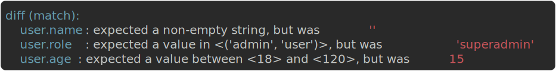

# Matchers

Matchers are reusable, composable condition objects. Import the `match` namespace:

```python
from assertpy2 import assert_that, match
```

Combine them with `&` (and), `|` (or), `~` (not), and use them with `satisfies()`, `each()`,
`contains()`, `matches_structure()`, or plain `==`.

## Using matchers

### satisfies()

Test a value against a matcher or a composition:

```python
assert_that(42).satisfies(match.greater_than(0))
assert_that(42).satisfies(match.greater_than(0) & match.less_than(100))
assert_that("hello").satisfies(~match.equal_to("world"))
assert_that(150).satisfies(match.is_negative() | match.greater_than(100))
```

### each()

Check that every element of a collection matches:

```python
assert_that([18, 25, 30]).each(match.between(18, 120))
assert_that(["a", "bb", "ccc"]).each(match.is_instance_of(str))
```

`each()` also accepts a plain predicate:

```python
assert_that([2, 4, 6]).each(lambda x: x % 2 == 0)
```

### Inside contains()

A matcher passed to `contains()` is tested against each element:

```python
assert_that([3, 7, 12]).contains(match.greater_than(10))
assert_that(["foo", "bar"]).contains(match.matches_regex(r"^f"))
```

## Composition

Matchers support Python operators, including nesting:

```python
positive_and_small = match.is_positive() & match.less_than(10)
extreme = match.less_than(-100) | match.greater_than(100)
not_empty = ~match.is_empty()
complex_check = (match.greater_than(0) & match.less_than(100)) | match.equal_to(-1)

assert_that(50).satisfies(complex_check)
assert_that(-1).satisfies(complex_check)
```

## Drop-in with plain `==`

Matchers implement `__eq__`, so they work with a bare `assert` and pytest introspection, with no
`assert_that()` wrapper:

```python
assert 42 == match.is_positive()
assert {"id": 5, "name": "Alice"} == {
    "id": match.is_positive(),
    "name": match.is_non_empty_string(),
}
assert [1, 2, 3] == [match.is_positive(), match.is_positive(), match.is_positive()]
assert 42 == (match.is_positive() & match.less_than(100))
```

??? failure "What pytest shows on failure"
    ```
    AssertionError: assert -5 == a positive value
    ```

    The `==` form hands rendering to pytest, so you get pytest's own message without a path-level
    diff. For the rich `match` diff, use the fluent form (`satisfies()`, `matches_structure()`) -
    see [Errors & Reporting](errors.md#rich-pytest-diffs).

!!! tip
    This makes matchers a drop-in addition to an existing suite: add one import, use `match.*` in any
    `==` comparison, no rewrite required.

Matcher `==` never raises: an operand the predicate cannot evaluate (a string handed to
`match.is_positive()`, an object with no ordering) simply compares as not equal, so a matcher that
leaks into a membership check or a foreign comparison stays safe.

## Available matchers

| Matcher | Matches |
|---|---|
| `match.equal_to(val)` | a value equal to `val` |
| `match.greater_than(val)` | a value greater than `val` |
| `match.greater_than_or_equal_to(val)` | a value greater than or equal to `val` |
| `match.less_than(val)` | a value less than `val` |
| `match.less_than_or_equal_to(val)` | a value less than or equal to `val` |
| `match.between(low, high)` | a value in the inclusive range `low` to `high` |
| `match.close_to(val, tolerance)` | a value within `tolerance` of `val` |
| `match.is_none()` | `None` |
| `match.is_not_none()` | a non-`None` value |
| `match.is_instance_of(type)` | an instance of `type` |
| `match.is_truthy()` | a truthy value |
| `match.is_falsy()` | a falsy value |
| `match.has_length(n)` | a value whose `len()` equals `n` |
| `match.is_empty()` | an empty collection or string |
| `match.is_not_empty()` | a non-empty collection or string |
| `match.is_positive()` | a number greater than zero |
| `match.is_negative()` | a number less than zero |
| `match.is_zero()` | zero |
| `match.is_even()` | an even integer |
| `match.is_odd()` | an odd integer |
| `match.is_divisible_by(n)` | an integer divisible by `n` |
| `match.is_callable()` | a callable object |
| `match.is_in(*values)` | a value present in `values` |
| `match.has_property(name, matcher?)` | an object with attribute `name`, optionally matching a nested matcher |
| `match.contains_string(sub)` | a string containing `sub` |
| `match.matches_regex(pattern)` | a string where `pattern` is found (`re.search`) |
| `match.starts_with(prefix)` | a string starting with `prefix` |
| `match.ends_with(suffix)` | a string ending with `suffix` |
| `match.is_uuid()` | a string parseable as a UUID |
| `match.is_non_empty_string()` | a non-empty string |
| `match.is_now(delta=2)` | a `datetime` within `delta` (seconds or a `timedelta`) of now; handles naive and tz-aware values |
| `match.is_before(dt)` | a `datetime` strictly before `dt` (a non-comparable value never matches) |
| `match.is_after(dt)` | a `datetime` strictly after `dt` (a non-comparable value never matches) |
| `match.ignore()` | anything (placeholder for structural matching) |
| `match.each_item(matcher)` | an iterable whose every item matches `matcher` |
| `match.structure(spec)` | a dict or model matching a nested `spec` |
| `match.all_of(*matchers)` | a value matching all of `matchers` |
| `match.any_of(*matchers)` | a value matching any of `matchers` |
| `match.not_(matcher)` | a value not matching `matcher` |

`all_of()`, `any_of()`, and `not_()` are named function equivalents of the `&`, `|`, and `~`
operators from [Composition](#composition); use whichever reads better.

## Structural matching

Validate dict structure declaratively, ideal for API responses where some values are dynamic
(IDs, timestamps):

```python
response = {
    "id": "550e8400-e29b-41d4-a716-446655440000",
    "name": "Alice",
    "age": 30,
    "active": True,
}

assert_that(response).matches_structure({
    "id": match.is_uuid(),
    "name": match.equal_to("Alice"),
    "age": match.between(18, 120),
    "active": match.equal_to(True),
})
```

The value under test can be a plain dict or a Pydantic model (anything exposing `model_dump()`); a
model is normalized to its dict before matching, so the same spec works either way, including inside
`satisfies()` and the `==` form. Normalization applies at every level - a model nested inside a plain
dict matches too, and failure paths still point at the leaf field (`address.city`):

```python
from pydantic import BaseModel

class User(BaseModel):
    id: str
    name: str

user = User(id="550e8400-e29b-41d4-a716-446655440000", name="Alice")

assert_that(user).matches_structure({"id": match.is_uuid(), "name": match.equal_to("Alice")})
assert_that(user).satisfies(match.structure({"id": match.is_uuid()}))
assert user == match.structure({"id": match.is_uuid()})
```

!!! note
    A model is matched in its `model_dump()` form: nested models become dicts, `@field_serializer` and
    `@computed_field` outputs are applied, and spec keys are the model's field names (not aliases). The
    spec is matched against this serialized shape, not the live attributes. This is a runtime structural
    check; the spec keys and values are not type-checked against the model's schema.

### Nested structures

Use `match.structure()` for nested dicts:

```python
assert_that({
    "user": {"name": "Alice", "role": "admin"},
    "metadata": {"version": 2},
}).matches_structure({
    "user": match.structure({
        "name": match.is_non_empty_string(),
        "role": match.contains_string("admin"),
    }),
    "metadata": match.structure({"version": match.greater_than(0)}),
})
```

### Ignoring and collections

`match.ignore()` skips a field; `match.each_item()` checks every element of a nested collection:

```python
assert_that({"id": "abc-123", "tags": ["python", "testing"]}).matches_structure({
    "id": match.ignore(),
    "tags": match.each_item(match.is_instance_of(str)),
})
```

!!! note
    `each_item` iterates the value twice on failure (once to decide, once to describe the failing
    item), so pass a materialized sequence - a one-shot generator will produce a correct verdict but
    a degraded failure message.

!!! note
    Keys present in the value but absent from the spec are ignored, so a structure spec validates a
    subset of fields rather than requiring an exact match.

### What you see on failure

When fields do not match, the pytest plugin prints the exact path and the predicate that failed - every
mismatch, not just the first:



The same `match` diff is produced by [`satisfies()`](#satisfies) and [`each()`](#each) whenever a
matcher fails inside an assertion.

## Custom matchers

`register_matcher()` adds your own matcher to the `match` namespace. Custom matchers compose with
`&`, `|`, `~` and work everywhere matchers are accepted.

```python
from assertpy2 import assert_that, match, register_matcher

@register_matcher("is_valid_email")
def is_valid_email():
    return match.matches_regex(r"^[\w.-]+@[\w.-]+\.\w+$")

assert_that("alice@example.com").satisfies(match.is_valid_email())
```

Parametrised matchers take arguments:

```python
@register_matcher("has_status")
def has_status(expected: str):
    return match.has_property("status", match.equal_to(expected))

assert_that(order).satisfies(match.has_status("active"))
```

They compose and nest like built-ins:

```python
assert_that(email).satisfies(match.is_valid_email() & match.contains_string("@company.com"))
assert_that(response).matches_structure({
    "email": match.is_valid_email(),
    "status": match.has_status("active"),
})
```

??? note "Removing a custom matcher"
    ```python
    from assertpy2 import unregister_matcher

    unregister_matcher("is_valid_email")
    ```

    `unregister_matcher(name)` removes one matcher by name (and raises `KeyError` if it is not
    registered); `clear_custom_matchers()` removes every custom matcher at once, handy for test
    teardown.
